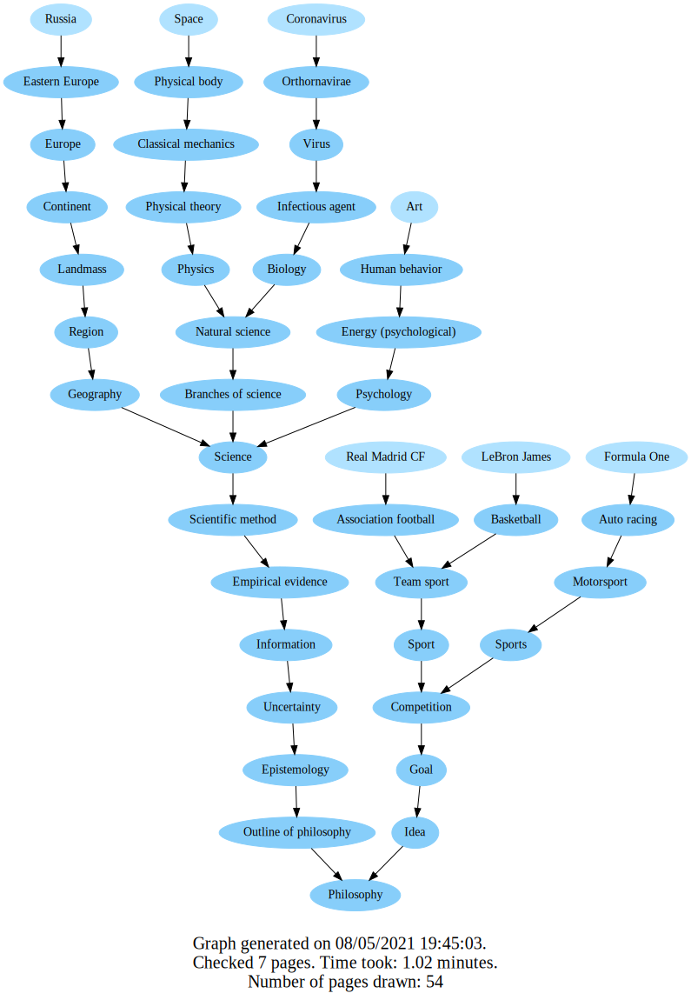
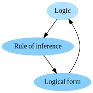
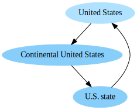
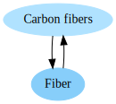

# Wiki Graph

A script created to check the **"Getting to Philosophy"** phenomenon:\
Clicking on the first link in the main text of an English Wikipedia article, and then repeating the process for
subsequent articles, leads to the Philosophy article.

You are welcome to read more about this interesting phenomenon
here: https://en.wikipedia.org/wiki/Wikipedia:Getting_to_Philosophy

I created a python script which "plays" this "game" and generates a nice Graph showing the paths created by clicking the
first link in a Wikipedia article.\
For example the following graph, which ran on these first pages:\
"Russia", "Space", "Coronavirus", "Art", "LeBron James","Real Madrid" and "Formula One".\
(to view raw: [0.svg](https://raw.githubusercontent.com/Tom-stack3/wikiGraph/master/output_examples/0.svg)
, [0.pdf](https://raw.githubusercontent.com/Tom-stack3/wikiGraph/master/output_examples/0.pdf))



## How we decide what to click on?

Following the chain consists of:

- Clicking on the first non-parenthesized, non-italicized link.
- Ignoring external links, links to the current page, or red links (links to non-existent pages).
- Stopping when reaching "Philosophy", a page with no links or a page that does not exist, or when a loop occurs.

The function that decides what we should click-on is: ```is_href_valid()```, located in the ```WikiPage.py```, in
class ```WikiPage```. It gets a href html tag, parsed with bs4(BeautifulSoup) and decides if it is valid to click on or
not. If the page is valid - it returns ```True```, otherwise - ```False```.\
You can go take a look on the checks it does, but in general we check the following stuff:

1. It is indeed a link to a Wikipedia article. Meaning it is not an external link to somewhere outside Wikipedia.

2. It is not a link enclosed in brackets.\
   For example in [Epistemology](https://en.wikipedia.org/wiki/Epistemology) the first link that is clicked shouldn't
   be ```(🔊listen)```, ```Greek``` or ```ἐπιστήμη```. The right link to click on is ```branch of philosophy``` instead.

3. It is not a side-comment, meaning the link is not in the following tags:
    1. italicized (```<i>```)
    2. smaller text (```<small>```)
    3. supper text (```<sup>```)

4. It is not a link to a disambiguation page.

## How the graph is generated?

To generate the graph, I use a very convenient open-source library I found called [Graphviz](https://graphviz.org/).

## Output formats

The [Graphviz](https://graphviz.org/) library supports tons of output formats (
their [documentation](https://graphviz.org/doc/info/output.html)). In this project I preferred to use **.SVG** and
**.PDF** files. Both preserve "quality" when zooming in.

One advantage of **.SVG** over **.PDF** files is that it allows adding URL links onto nodes, a feature which I found
very useful. Consequently, the nodes of the graphs in the **.SVG** files are clickable and lead to the Wikipedia page
they represent.

## Loops found 😯

Of course the "[Getting to Philosophy](https://en.wikipedia.org/wiki/Wikipedia:Getting_to_Philosophy)" phenomenon doesn't happen in 100% percent of the cases, and they are some loopholes in it. Some
interesting loops of Wikipedia articles I found:

- [Logic](https://en.wikipedia.org/wiki/Logic) ➜ [rules of inference](https://en.wikipedia.org/wiki/Rule_of_inference)
  ➜ [Logical form](https://en.wikipedia.org/wiki/Logical_form) ➜ [Logic](https://en.wikipedia.org/wiki/Logic) again :)
- [United States](https://en.wikipedia.org/wiki/United_States)
  ➜ [Contiguous United States](https://en.wikipedia.org/wiki/Contiguous_United_States)
  ➜ [U.S. states](https://en.wikipedia.org/wiki/U.S._state)
  ➜ [United States](https://en.wikipedia.org/wiki/United_States)  again :)
- [Carbon fibers](https://en.wikipedia.org/wiki/Carbon_fibers) ➜ [fibers](https://en.wikipedia.org/wiki/Fiber)
  ➜ [Carbon fibers](https://en.wikipedia.org/wiki/Carbon_fibers) again :)\
  <small>notice that the first two links in [fibers](https://en.wikipedia.org/wiki/Fiber) are local links, leading to a
  section in the article, so we ignore and skip them:
  ... "*is a <a href="#Natural_fibers">natural</a> or <a href="#Man-made_fibers">man-made</a> substance*"
  ...</small>

<table>
  <tr>
    <th></th>
    <th></th> 
    <th></th>
  </tr>
 </table>


## Examples:

<sup>*Created by Tommy Zaft*</sup>
